- title : Leading as a Grunt: Finding Leadership Opportunities Wherever You Find Yourself
- description : Leadership as a set of behaviors, not a title
- author : John Strobel
- theme : night
- transition : default

***

## Leading as a Grunt
#### Finding Leadership Opportunities Wherever You Find Yourself

John Strobel | @devunit1

***

# Welcome and Introduction

***

## A bit about my own story

---

5 years at Progressive as a developer

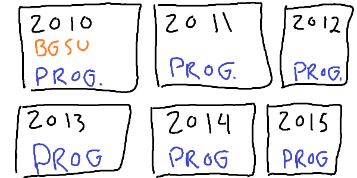

---

On a project for two years

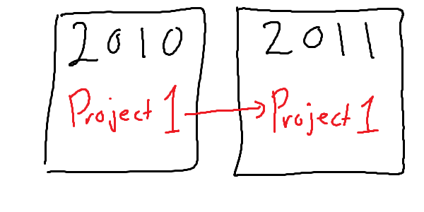

---

The first year was just learning

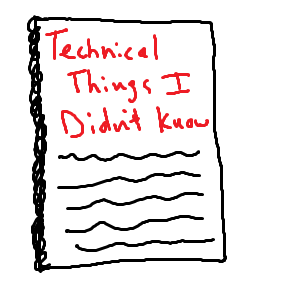

---

Started looking for leadership opportunities

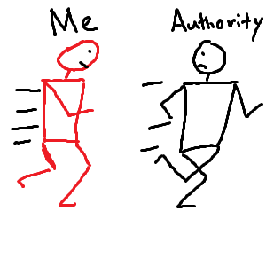

---

But you can't have authority as a newbie

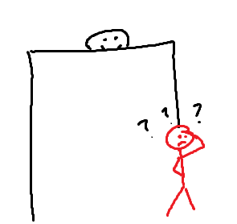

---

Leaders are defined by their followers

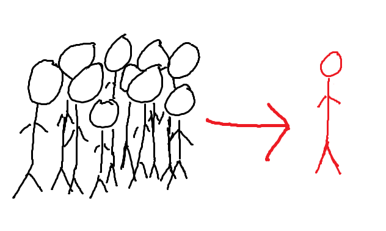

---

Through Observation, this became clear:

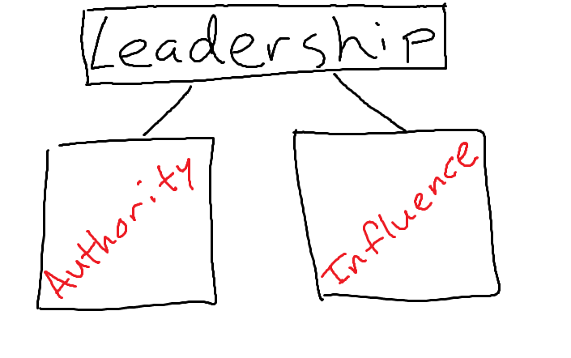

***

## Authority

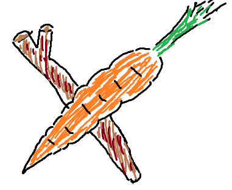

---

### Authority
"The power or right to give orders, make decisions, and enforce obedience"

-- Oxford Dictionaries via Bing

---

More simply

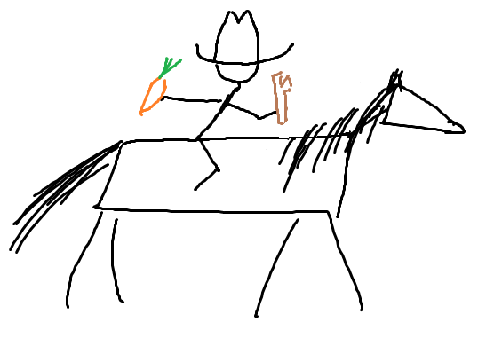

---

Rewards for "good" behavior

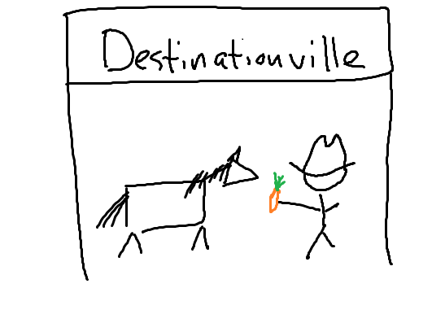

---

Punishments for "bad" behavior

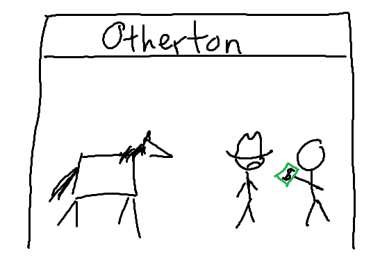

---

Spectrum of Authority

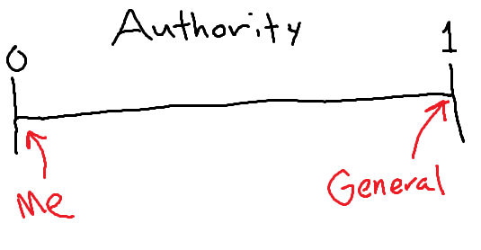

---

The drawback: I don't control authority

---

Leadership is more than just authority...

***

## Influence

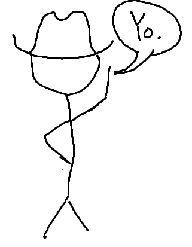

---

### Influence
"The capacity to have an effect on the character, development, or behavior of someone or something, or the effect itself"

-- The Oxford Dictionary via Bing

---

Put more simply

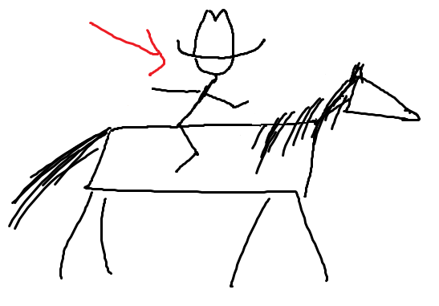

---

Riders suggest destinations, but the horse chooses

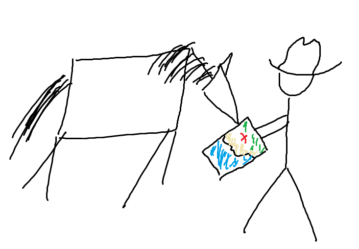

---

Riders and horses have good relationships (or carrots and sticks)

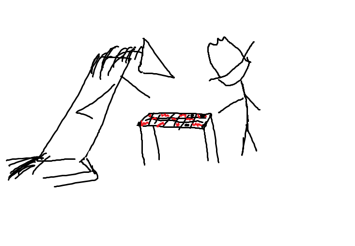

---

Influence can be negative

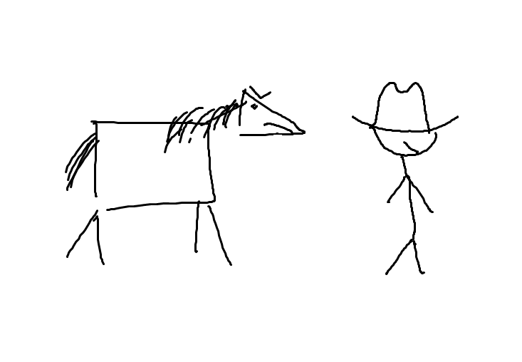

---

Negative influence has effects, too!

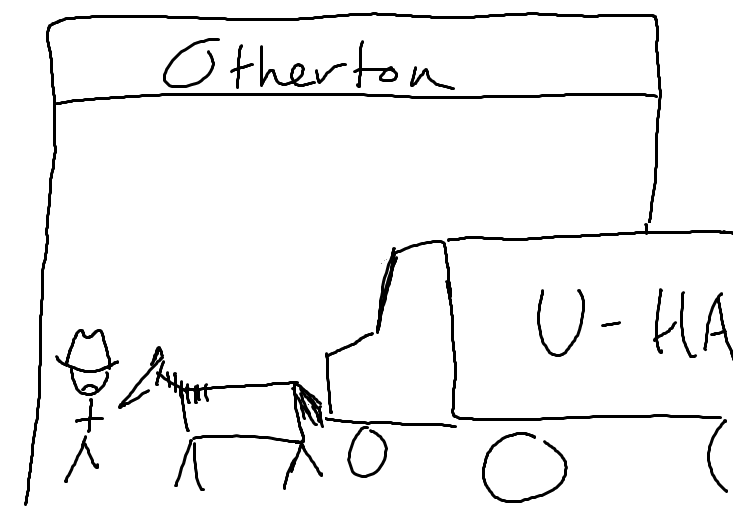

---

Negativity and positivity both ripple outwards

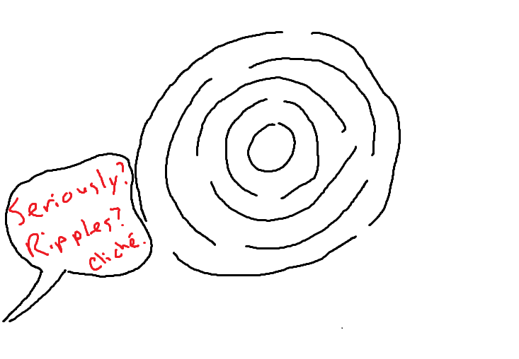

---

The spectrum of Influence

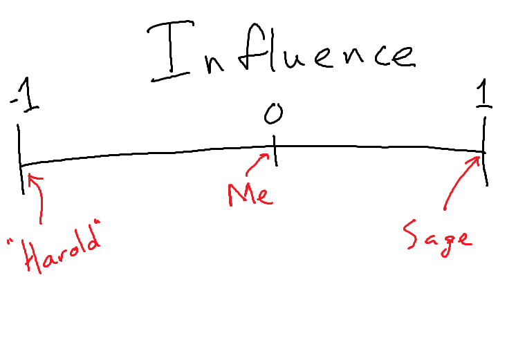

---

The drawback: I don't control influence

---

Well shucks

***

## On variable control

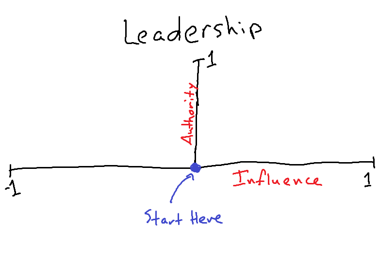

---

#### I made a list

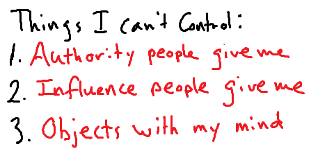

---

#### I made another list

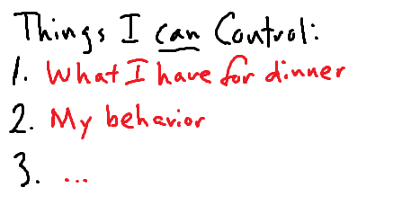

---

# I CAN CONTROL MY OWN BEHAVIORS!

---

Why is this guy so excited about that?

***

## Behaviors as they Relate to Influence

---

Maniacal laughter would make you think I'm crazy	

---

People adjust their own behavior to react to yours

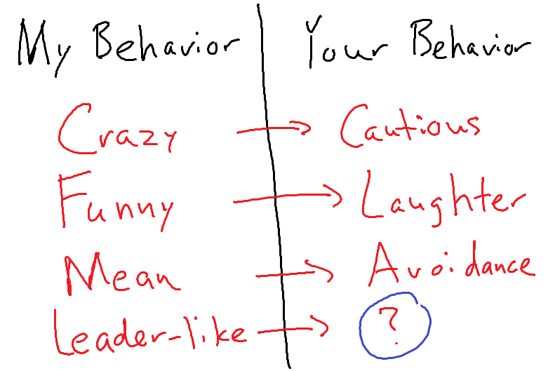

---

Over time, acting like a leader grows trust and influence

---

&there4; Acting "Leader-y" grows my influence 

... over time

---

I looked at my project again

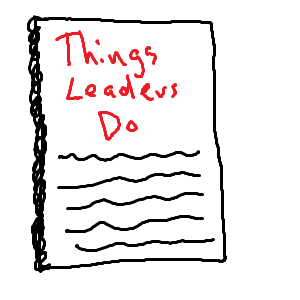

---

Leaders become so because they act so

***

## Behaviors, Influence, and Authority

---

If you demonstrate a pattern of convincing people to listen to you...

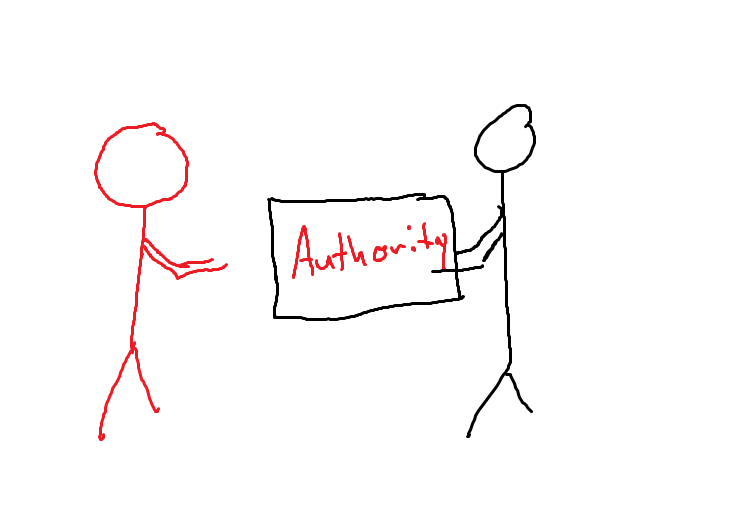

---

There are many paths to Authority

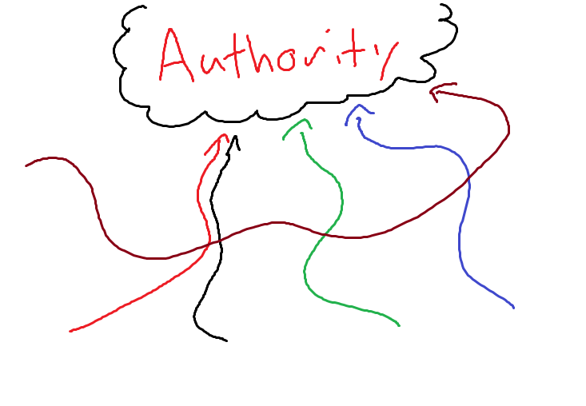

***

## Leadership Behaviors - A quick caveat

---

Please note: these worked for *me*, and I'm weird

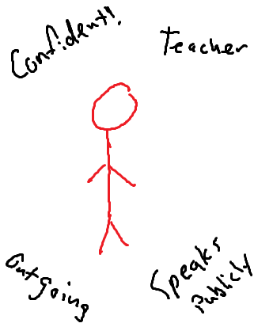

---

Find what works for *you*

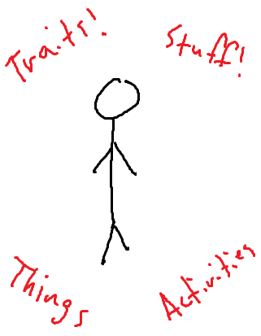

***

## Leadership Behaviors

---

Leadership Behaviors:

- Be Self-Aware
- Questions, asking and answering
- Be wrong (and right)
- Share your network with people - Make introductions
- Focus on solving the problem
- Always focus on helping others

---

Be Self-Aware

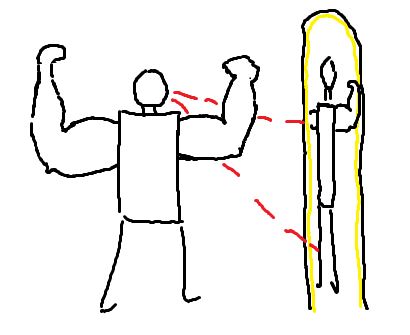

---

Questions - Ask them surgically

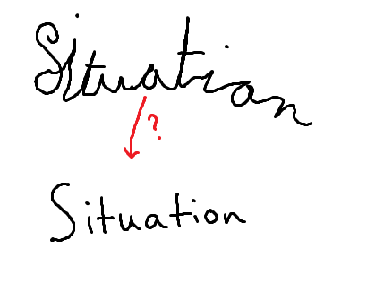

---

Questions - Answer them to help others

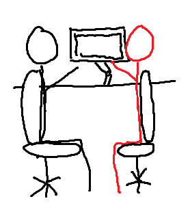

---

Be able to be wrong (or right) *graciously*

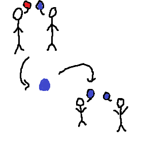

---

Leverage your own network for others

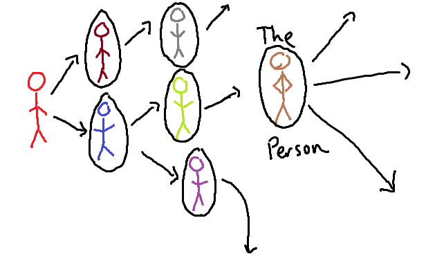

---

Focus on solving the problem, not laying blame

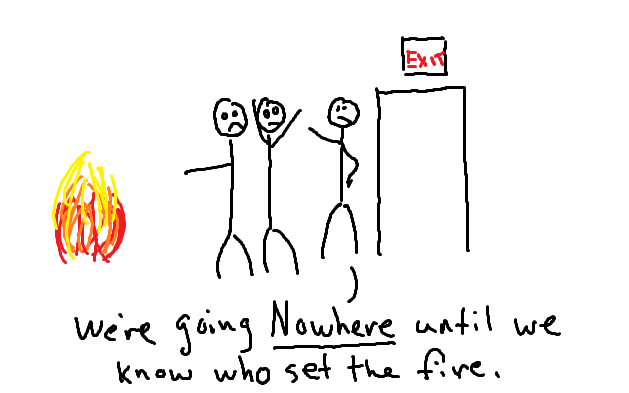

---

Always, always always help others 

***

Questions, Discussion, or The Gift of Time

Thank you!